# Hangman Game

Hangman Game is a guessing game written with python and that runs on a terminal. The player has to guess the word, by inputting letters or words into the terminal. However, the player is limited to 7 wrong attempts. If the player does not guess correctly the word within those attempts, the man is hung and the game is lost. 

[Play Hangman Game](https://game-hangman.herokuapp.com/)

## Table Of Contents 

* [How To Play](#how-to-play)

* [Planning](#planing)
    * [User Experience](#user-experience)
        * [User Goals](#user-goals)
    * [Flowchart Diagram](#flowchart-diagram)

* [Features](#features)
    * [Existing Features](#existing-features)
    * [Future Features](#future-features)

* [Testing](#testing)
    * [Manual Testing](#manual-testing)
    * [Validator](#validator)

* [Technologies Used](#technologies-used)

* [Bugs](#bugs)
    * [Fixed Bugs](#fixed-bugs)
    * [Unfixed Bugs](#unfixed-bugs)

* [Deployment](#deployment)

* [Credits](#credits)
    * [Code Used](#code-used)
    * [Content](#content)

* [Acknowledgments](#acknowledgments)

## How To Play 

To start playing, the player must enter their name and then press enter. 
The player is shown a set of blank spaces that match a word and has to guess the letters or word in order to reveal the hidden word. If the player inputs the letter that is in the hidden word, that letter is revealed, however if the letter is not in the word, then a stickman is slowly drawn. With each wrong guess, the man is drawn more and more and after 7 wrong attempts the man is hung and the game is lost. If the player guess the word before the 7 wrong attempts then the full word is revealed and the player wins. 

If the player enters an invalid character, an error message is displayed and the player is asked again to input their choice.

## Planing 

### User Experience

#### User Goals 

* The users want a classic and simple game that is easy to learn and quick to play.
* The users want a fun way to pass the time and challenge themselves.
* The users want a game to improve their vocalurary, as they will need to think about the meaning of the words and how they are spelled in order to make correct guesses. 

Overall, the users want a fun and enjoyable game that can provide entertainment and mental exercise. 

### Flowchart Diagram

## Features

### Existing Features

#### Welcome Art

* Display an art with the messsage "Welcome to the Hangman Game".

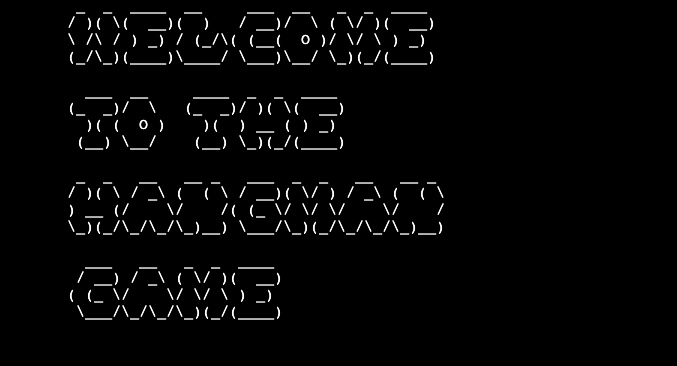

#### Get Player Name

* Get the name of the player.

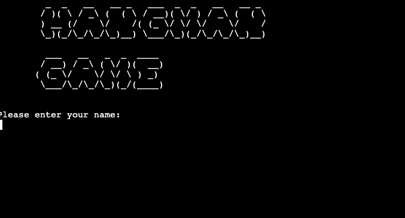

### Rules

* Welcomes the player to the game and shows the rules.

### Game Area

* The main area of the game. It displays:
    * Guessed letters
    * Hangman draw
    * Attempts left
    * The length of the word
    * The blank space where the word is hidden
    * Input field

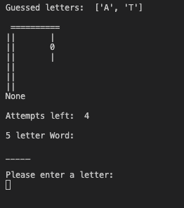

### Error Messages

* Displays ValueError if the player:
    * Enters invalid input.
    * Enters an already guessed letter.
    * Enters an already guessed word.

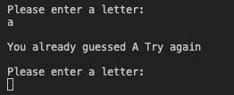
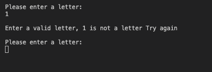

### Feedback

* Gives feedback to the player if:
    * The letter is in the word.
    * The letter is not in the word.
    * The word is not the correct word.

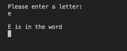

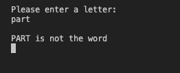

### Win and Lose Art

* Displays the "you win" art if the player correctly guesses the word, and "you lose" if the player runs out of attempts.

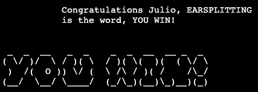
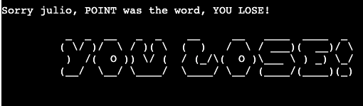

### Play Again

* Gives the player the option to play again.

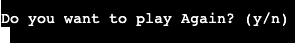

### Future Features

In the future i want to add the following features:

* Scoring system.
* Top high Scores. 
* A game menu.
* Dificulty levels

## Testing

### Manual Testing

I have manually tested this project and made sure that all the features worked as intended. The game operates differently on the Heroku terminal compared to the Gitpod terminal, and I have encountered several bugs during testing and some I was unable to resolve. I have listed these bugs under the "unfixed bugs" section. 

### Validator

Tested the code through CI Python Linter and fixed any errors. The art.py file generated several "invalid escape sequence" and "trailing whitespace" warnings, however, it is not possible to resolve these warnings without altering the appearance of the artwork. As the artwork is not critical to the main functionality of the code, I have placed them in a separate file.

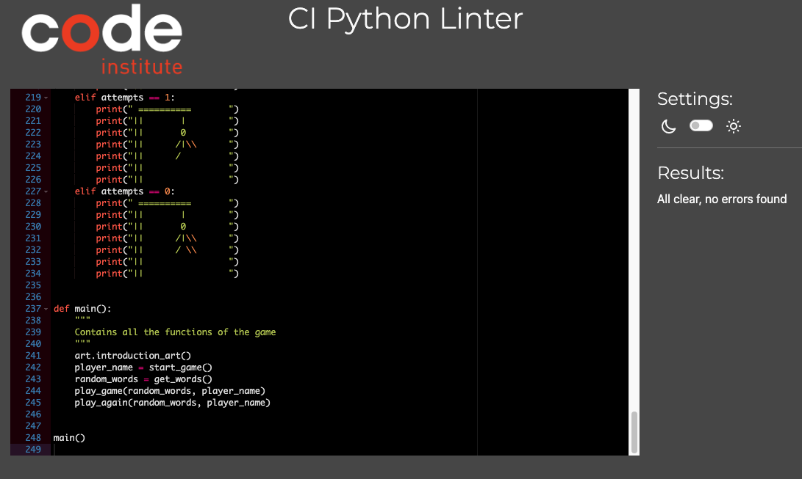

## Technologies Used

* [Text to ASCII Art Generator](https://patorjk.com/software/taag/#p=display&f=Graceful&t=You%20Lose!)
* Python as the main language of this project
* Git for version control
* GitHub to store project code
* Heroku to host the the live project
* [Code Institute's template](https://github.com/Code-Institute-Org/gitpod-full-template)
* [Lucidchart - FlowChart Diagram](https://www.lucidchart.com/pages/)
* [Amiresponsive](https://bytes.dev/?s=amiresponsive) for responsive mockup
* [CI Python Linter](https://pep8ci.herokuapp.com/)

## Bugs

### Fixed Bugs

During the development of this project I have encountered and fixed the following bugs:

* When the player is asked if they would like to play again, if they choose to do so, the game would continue using the same secret word that was used in the previous round.
    * Fix: Added the function that gets random words to the function that handles the play again functionality.
* When guessing the word incorrectly, the hangman drawing was displaying the full hagman even though the game was not over. 
    * Fix: I had to reverse the order of attempts from 7 to 0 so that the drawing would progress correctly with each incorrect guess.
* On the Heroku terminal, the spaces to hold the secret word would appear as a continuous line instead of separated underscores. This made it difficult for the player to determine the number of letters in the word.
    * Fix: I added a print statement that displays the number of letters in the word to the player.

### Unfixed Bugs

* On the Heroku app, the terminal was not clearing properly and pieces of the previous game were appearing at the top of the screen. This bug did not occur on the gitpod terminal where the game was developed, but only on the Heroku terminal. I did not have enough time to fix this issue but i plan to address it in my next update.

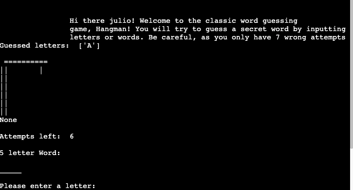
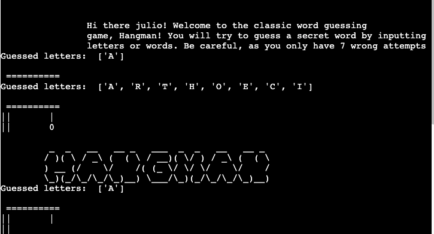

## Deployment

The Hangman game was deployed using Heroku. The steps used are the following:

1. Login to Heroku account.
2. Click "create new app" button on Heroku dashboard.
3. Enter the app name and select your region.
4. Click "creat app".
5. Head to settings tab.
6. On Config Vars section click "reveal config var".
7. Add key (PORT) and value (8000) and then click "add".
8. On Buildpack section click "Add buildpack"
9. Select python and click "save changes". Repeat the same for Nodejs.
10. Head to Deplaoy tab.
11. On deployment method section, select GitHub.
12. Connect to your Github account.
13. Enter the project name you wish to deploy, click "search" and when the project name appears, click "connect".
14. On automatic deploys section click "Enable automatic deploys".
15. On manual deploys click "Deploy branch".
16. You will get a message that your app was succesfully deployed and a view button to see the live app.

## Credits

### Code Used

* [Code to allow only letters when taking user input](https://bobbyhadz.com/blog/python-input-only-letters-allowed)
* [Python list comprehension](https://www.programiz.com/python-programming/list-comprehension)
* [Python enumerate()](https://realpython.com/python-enumerate/)
* [How to build HANGMAN with Python](https://www.youtube.com/watch?v=m4nEnsavl6w&ab_channel=Kite)
* [Clear the terminal](https://www.scaler.com/topics/how-to-clear-screen-in-python/)
* [How to fix “invalid escape sequence”](https://adamj.eu/tech/2022/11/04/why-does-python-deprecationwarning-invalid-escape-sequence/)

### Content
* [Words](https://www.randomlists.com/random-words?dup=false&qty=50)

## Acknowledgments

I would like to thank the following people:

* My girlfriend for her patience and support while I was working on the project

* My mentor, Mitko, for his guidance throughout the project

* My collegues from code institute for the support and motivation on Slack

