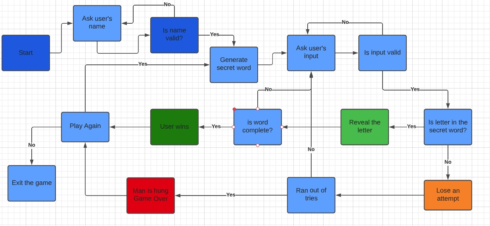

# Hangman Game

Hangman Game is a guessing game written with python and that runs on a terminal. The player has to guess the word, by inputting letters or words into the terminal. However, the player is limited to 7 wrong attempts. If the player does not guess correctly the word within those attempts, the man is hung and the game is lost. 

[Play Hangman Game]()

## Table Of Contents 

* [How To Play](#how-to-play)

* [Planning](#planing)
    * [User Experience](#user-experience)
        * [User Goals](#user-goals)
    * [Flowchart Diagram](#flowchart-diagram)

* [Features](#features)
    * [Existing Features](#existing-features)
    * [Future Features](#future-features)

* [Testing](#testing)
    * [Manual Testing](#manual-testing)
    * [Validator](#validator)

* [Technologies Used](#technologies-used)

* [Bugs](#bugs)
    * [Fixed Bugs](#fixed-bugs)
    * [Unfixed Bugs](#unfixed-bugs)

* [Deployment](#deployment)

* [Credits](#credits)
    * [Code Used](#code-used)
    * [Content](#content)
    * [Media](#media)

* [Acknowledgments](#acknowledgments)

## How To Play 

To start playing, the player must enter their name and then press enter. 
The player is shown a set of blank spaces that match a word and has to guess the letters or word in order to reveal the hidden word. If the player inputs the letter that is in the hidden word, that letter is revealed, however if the letter is not in the word, then a stickman is slowly drawn. With each wrong guess, the man is drawn more and more and after 7 wrong attempts the man is hung and the game is lost. If the player guess the word before the 7 wrong attempts then the full word is revealed and the player wins. 

If the player enters an invalid character, an error message is displayed and the player is asked again to input their choice.

## Planing 

### User Experience

#### User Goals 

* The users want a classic and simple game that is easy to learn and quick to play.
* The users want a fun way to pass the time and challenge themselves.
* The users want a game to improve their vocalurary, as they will need to think about the meaning of the words and how they are spelled in order to make correct guesses. 

Overall, the users want a fun and enjoyable game that can provide entertainment and mental exercise. 

### Flowchart Diagram

## Features

### Existing Features

### Future Features

## Testing

### Manual Testing

### Validator

## Technologies Used

* [Text to ASCII Art Generator](https://patorjk.com/software/taag/#p=display&f=Graceful&t=You%20Lose!)
* Python as the main language of this project
* Git for version control
* GitHub to store project code
* Heroku to host the the live project
* [Code Institute's template](https://github.com/Code-Institute-Org/gitpod-full-template)
* [Lucidchart - FlowChart Diagram](https://www.lucidchart.com/pages/)

## Bugs

### Fixed Bugs

### Unfixed Bugs

## Deployment

## Credits

### Code Used

* [Code to allow only letters when taking user input](https://bobbyhadz.com/blog/python-input-only-letters-allowed)
* [Python list comprehension](https://www.programiz.com/python-programming/list-comprehension)
* [Python enumerate()](https://realpython.com/python-enumerate/)
* [How to build HANGMAN with Python](https://www.youtube.com/watch?v=m4nEnsavl6w&ab_channel=Kite)
* [Clear the terminal](https://www.scaler.com/topics/how-to-clear-screen-in-python/)

### Content
* [Words](https://www.randomlists.com/random-words?dup=false&qty=50)

### Media 

## Acknowledgments

